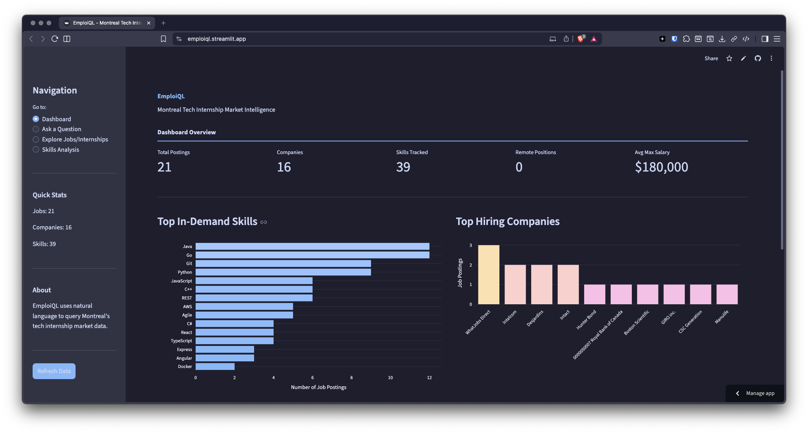
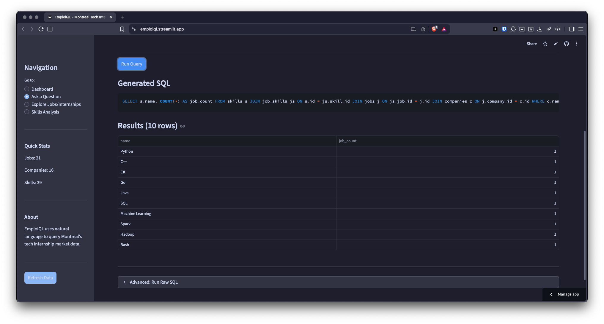
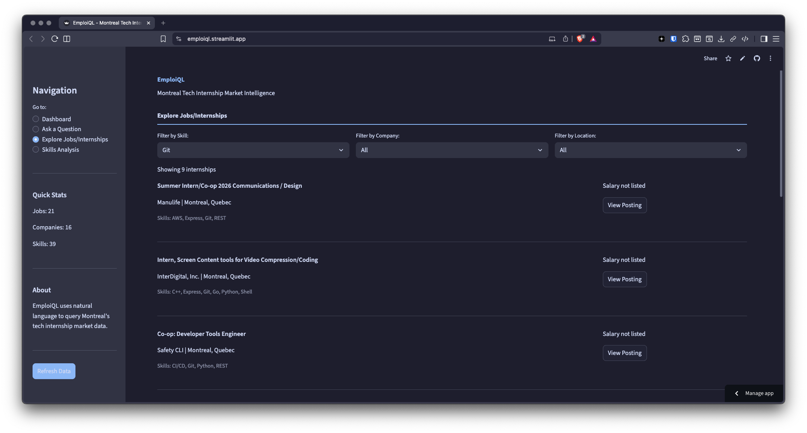
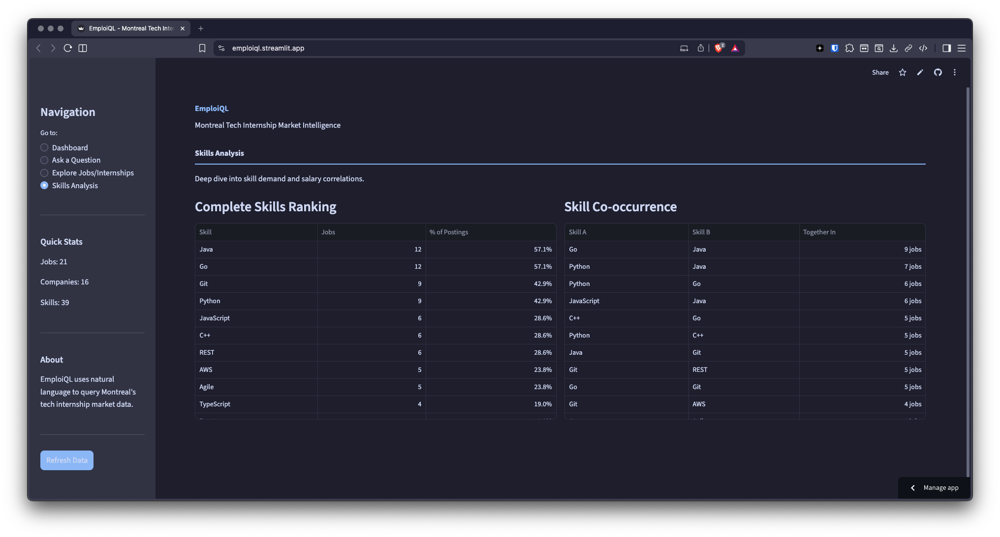

# EmploiQL

a natural language interface for querying montreal's tech job market. ask questions in plain english or french and get answers from a postgresql database of job postings.

```
"what are the top 10 most requested skills?"
     ↓
SELECT s.name, COUNT(*) AS job_count
FROM skills s
JOIN job_skills js ON s.id = js.skill_id
GROUP BY s.id, s.name
ORDER BY job_count DESC
LIMIT 10;
     ↓
┌────────────┬───────────┐
│ name       │ job_count │
├────────────┼───────────┤
│ Python     │ 12        │
│ JavaScript │ 9         │
│ Java       │ 8         │
│ ...        │ ...       │
└────────────┴───────────┘
```

---

## screenshots

### dashboard overview


### natural language queries
ask questions in plain english or french - the system converts them to sql automatically.




### explore job postings
filter and browse internships by skill, company, or location.



### skills analysis
see skill demand, frequency, and co-occurrence patterns.



---

## what it does

- **fetches job postings** from jsearch api (indeed, linkedin, etc.)
- **extracts structured data** using gpt-4o-mini (skills, salary, location)
- **stores everything** in a normalized postgresql database
- **answers questions** by converting natural language to sql with gpt-4o
- **visualizes trends** through a streamlit dashboard

---

## quick start

### 1. clone and install dependencies

```bash
git clone https://github.com/yourusername/emploiql.git
cd emploiql
pip install -r requirements.txt
```

### 2. set up environment variables

create a `.env` file in the project root:

```bash
OPENAI_API_KEY=your-openai-api-key
RAPIDAPI_KEY=your-rapidapi-key-for-jsearch
```

get your api keys:
- openai: https://platform.openai.com/api-keys
- rapidapi (jsearch): https://rapidapi.com/letscrape-6bRBa3QguO5/api/jsearch

### 3. create the database

```bash
./scripts/setup_db.sh
```

this creates a postgresql database called `EmploiQL` with all required tables.

### 4. fetch and load job data

```bash
# fetch jobs from jsearch api (uses 1 api call)
python3 src/jsearch.py --preset software --live

# load into database (--mock skips openai extraction to save costs)
python3 scripts/load_jsearch.py --preset software --mock
```

### 5. start querying

```bash
# interactive mode
python3 src/cli.py

# single question
python3 src/cli.py "what skills are most in demand?"

# web dashboard
streamlit run src/app.py
```

---

## project structure

```
emploiql/
├── src/
│   ├── app.py           # streamlit dashboard
│   ├── cli.py           # command line interface
│   ├── config.py        # environment variable loading
│   ├── db.py            # database connection and crud operations
│   ├── extraction.py    # gpt-4o-mini job data extraction
│   ├── jsearch.py       # jsearch api integration
│   └── text_to_sql.py   # natural language to sql conversion
├── scripts/
│   ├── setup_db.sh      # creates postgresql database
│   ├── load_jsearch.py  # loads jobs into database
│   ├── test_schema.py   # validates database schema
│   └── test_db.py       # tests crud operations
├── documentation/
│   └── schema.md        # database schema documentation
├── data/
│   └── jsearch_cache/   # cached api responses (gitignored)
├── schema.sql           # database table definitions
├── commands.md          # command reference
├── requirements.txt     # python dependencies
└── .env                 # api keys (gitignored)
```

---

## database schema

five normalized tables designed to store job postings without duplicating data:

```
companies ──────────────┐
                        ▼
raw_postings ────────► jobs ◄────── job_skills ────► skills
```

| table | purpose |
|-------|---------|
| **companies** | stores each company once (name, website) |
| **jobs** | job postings with title, description, salary, location |
| **skills** | master list of normalized skill names |
| **job_skills** | junction table linking jobs to skills (many-to-many) |
| **raw_postings** | archived raw content before processing |

see [documentation/schema.md](documentation/schema.md) for full details.

---

## usage

### command line interface

```bash
# start interactive repl
python3 src/cli.py

# ask a single question
python3 src/cli.py "which companies have the most postings?"

# run preset queries
python3 src/cli.py --preset skills
python3 src/cli.py --preset companies
python3 src/cli.py --preset remote

# show database statistics
python3 src/cli.py --stats

# execute raw sql (select only)
python3 src/cli.py --sql "SELECT * FROM companies LIMIT 5"
```

#### available presets

| preset | description |
|--------|-------------|
| `skills` | top 10 most requested skills |
| `companies` | companies with most postings |
| `remote` | remote job opportunities |
| `python` | jobs requiring python |
| `salaries` | jobs with salary info |
| `recent` | most recently added postings |
| `devops` | devops/cloud jobs |
| `fullstack` | full-stack development jobs |

### streamlit dashboard

```bash
streamlit run src/app.py
```

features:
- overview metrics (total jobs, companies, skills)
- top skills bar chart
- top hiring companies
- jobs by location pie chart
- salary by skill analysis
- natural language query interface
- job exploration with filters
- skill co-occurrence analysis

### fetching jobs

```bash
# using presets (recommended)
python3 src/jsearch.py --preset software --live
python3 src/jsearch.py --preset devops --live
python3 src/jsearch.py --preset data --live

# custom queries
python3 src/jsearch.py --query "python intern" --live
python3 src/jsearch.py --query "react developer" --location "Toronto, Canada" --live

# fetch multiple pages (10 jobs per page, 1 api call each)
python3 src/jsearch.py --preset software --pages 3 --live

# list available presets
python3 src/jsearch.py --list-presets

# list cached searches
python3 src/jsearch.py --list-cache
```

#### internship presets

| preset | query |
|--------|-------|
| `software` | software engineer intern |
| `developer` | software developer intern |
| `devops` | devops intern |
| `data` | data science intern |
| `cyber` | cybersecurity intern |
| `frontend` | frontend developer intern |
| `backend` | backend developer intern |
| `fullstack` | full stack developer intern |
| `ml` | machine learning intern |
| `qa` | qa engineer intern |

### loading jobs to database

```bash
# load from preset (with mock extraction - free)
python3 scripts/load_jsearch.py --preset software --mock

# load with full gpt extraction (costs ~$0.0001 per job)
python3 scripts/load_jsearch.py --preset software

# load all presets at once
python3 scripts/load_jsearch.py --all --mock

# limit jobs for testing
python3 scripts/load_jsearch.py --preset software --mock --limit 5
```

---

## how it works

### data pipeline

```
┌─────────────┐    ┌─────────────┐    ┌─────────────┐    ┌─────────────┐
│   jsearch   │───►│  raw_post   │───►│  gpt-4o-    │───►│  database   │
│     api     │    │   cache     │    │    mini     │    │   insert    │
└─────────────┘    └─────────────┘    └─────────────┘    └─────────────┘
     fetch              store            extract            normalize
```

1. **fetch**: jsearch api retrieves job postings from indeed, linkedin, etc.
2. **cache**: raw responses saved to `data/jsearch_cache/` to preserve api quota
3. **extract**: gpt-4o-mini extracts structured data (title, company, skills, salary)
4. **normalize**: skills are normalized ("python3" → "Python") and stored

### text-to-sql

```
┌─────────────┐    ┌─────────────┐    ┌─────────────┐    ┌─────────────┐
│   natural   │───►│   gpt-4o    │───►│  validate   │───►│   execute   │
│  language   │    │  generate   │    │   safety    │    │   query     │
└─────────────┘    └─────────────┘    └─────────────┘    └─────────────┘
    question           sql             check              results
```

1. **question**: user asks in plain english or french
2. **generate**: gpt-4o converts to sql using schema context + few-shot examples
3. **validate**: safety check blocks non-select queries (drop, delete, etc.)
4. **execute**: query runs against postgresql, results returned as dicts

### two-tier llm strategy

| model | purpose | cost |
|-------|---------|------|
| gpt-4o-mini | bulk data extraction | ~$0.0001/job |
| gpt-4o | text-to-sql (accuracy matters) | ~$0.001/query |

---

## example queries

the system understands natural language questions like:

```
what are the most in-demand skills?
show me python internships at ubisoft
which companies offer remote positions?
what's the average salary for devops roles?
list all cybersecurity internships
how many jobs require both python and sql?
show jobs that require aws, docker, or kubernetes
what skills does intact look for?
```

---

## api costs

### jsearch (rapidapi)
- free tier: 200 requests/month
- each page fetch = 1 request
- caching prevents duplicate api calls

### openai
- gpt-4o-mini extraction: ~$0.0001 per job posting
- gpt-4o text-to-sql: ~$0.001 per query
- mock mode available for testing (no api cost)

---

## development

### running tests

```bash
# test database schema
python3 scripts/test_schema.py

# test crud operations
python3 scripts/test_db.py
```

### checking configuration

```bash
python3 src/config.py
```

### database connection

the app supports two modes:

1. **local development**: connects to postgresql on localhost:5432
2. **cloud/production**: uses `DATABASE_URL` environment variable (supabase, heroku, etc.)

---

## tech stack

| component | technology |
|-----------|------------|
| database | postgresql |
| language | python 3.11 |
| db driver | psycopg2 |
| llm | openai gpt-4o, gpt-4o-mini |
| job data | jsearch api (rapidapi) |
| cli | rich |
| dashboard | streamlit, plotly |
| env management | python-dotenv |

---

## requirements

```
psycopg2-binary
openai>=1.0.0
rich>=13.0.0
requests>=2.31.0
beautifulsoup4>=4.12.0
python-dotenv>=1.0.0
streamlit>=1.28.0
plotly>=5.18.0
```

---

## troubleshooting

### "OPENAI_API_KEY not set"

create a `.env` file in the project root:
```
OPENAI_API_KEY=sk-your-key-here
```

### "could not connect to database"

make sure postgresql is running:
```bash
# mac
brew services start postgresql@16

# check if database exists
psql -l | grep EmploiQL
```

if database doesn't exist, run setup:
```bash
./scripts/setup_db.sh
```

### "no jobs found" when loading

fetch jobs first before loading:
```bash
python3 src/jsearch.py --preset software --live
python3 scripts/load_jsearch.py --preset software --mock
```

### rate limit errors from jsearch

the free tier has 200 requests/month. use caching:
```bash
# first time: fetch with --live
python3 src/jsearch.py --preset software --live

# subsequent runs: omit --live to use cache
python3 src/jsearch.py --preset software
```

---

## license

mit

---

## acknowledgments

- [jsearch api](https://rapidapi.com/letscrape-6bRBa3QguO5/api/jsearch) for job data
- [openai](https://openai.com/) for llm capabilities
- [rich](https://github.com/Textualize/rich) for beautiful terminal output
- [streamlit](https://streamlit.io/) for the dashboard framework